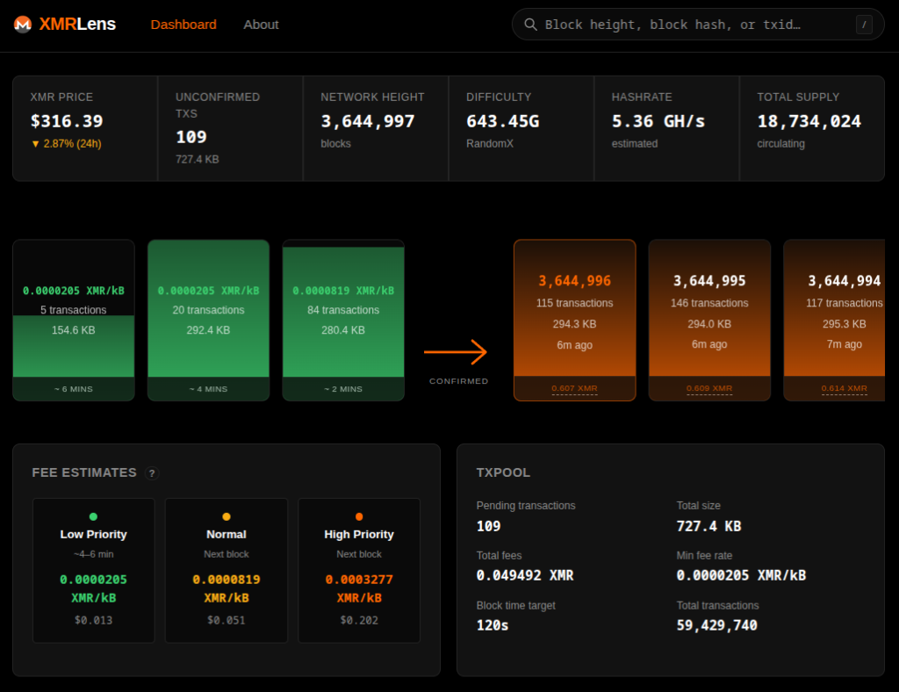

# 🔷 XMRLens - Monero TXPool

XMRLens is a real-time Monero (XMR) txpool and blockchain explorer, heavily inspired by the aesthetics and functionality of [mempool.space](https://mempool.space) for Bitcoin. It provides a visual, intuitive interface for monitoring the Monero transaction pool, recent blocks, and network health.




## ✨ Features

- **Projected TXPool Blocks**: Visualises the pending transaction pool as virtual "blocks" based on fee priority and Monero's dynamic block weight limits.
- **Real-time Updates**: Powered by WebSockets for instant notification of new transactions and blocks.
- **Recent Block History**: Detailed list of recently mined blocks with size, weight, and reward data.
- **Transaction & Block Details**: Deep dive into individual transaction hashes and block heights/hashes.
- **Network Statistics**: Monitor global network hashrate, difficulty, circulating emission, and node synchronization status.
- **Fee Estimation**: Provides recommended fee levels (Slow, Normal, Fast) based on current pool congestion.
- **P2Pool Detection**: Automatically identifies blocks mined via the P2Pool decentralized mining pool.
- **Multi-Currency Support**: View XMR prices and values in USD, EUR, BTC, and more.
- **Custom Themes**: Choose between Monero (Dark), Dusk, and Light modes.

---

## 🚀 Deployment (Docker)

The recommended way to run XMRLens. Requires [Docker](https://docs.docker.com/get-docker/) and a running Monero full node.

> **Note:** A full (non-pruned) Monero node is required. Pruned nodes do not serve the full transaction history needed for the block and transaction explorer pages.

### 1. Clone the repository

```bash
git clone https://github.com/dy0x/xmr-mempool.git
cd xmr-mempool
```

### 2. Configure environment

```bash
cp .env.example .env
```

Edit `.env` with your Monero node details:

```env
# Primary node
MONERO_NODE_1_HOST=127.0.0.1
MONERO_NODE_1_PORT=18081
MONERO_NODE_1_USER=monero
MONERO_NODE_1_PASS=your-rpc-password

# Optional fallback node (uncomment to enable)
# MONERO_NODE_2_HOST=your-backup-node
# MONERO_NODE_2_PORT=18081
# MONERO_NODE_2_TLS=true

# Port to expose the app on
APP_PORT=80
```

You can define as many fallback nodes as needed (`MONERO_NODE_3_*`, `MONERO_NODE_4_*`, …). The backend tries them in order and automatically switches back to a higher-priority node when it recovers.

### 3. Start

```bash
docker-compose up -d
```

The app will be available at `http://your-server-ip`. Add `--build` if you've made code changes.

---

## 🛠️ Development

### Prerequisites

- **Node.js**: v18 or later
- Access to a Monero node with RPC enabled

### Setup

1. **Clone and configure**:
   ```bash
   git clone https://github.com/dy0x/xmr-mempool.git
   cd xmr-mempool
   cp .env.example .env
   # Edit .env with your Monero node credentials
   ```

2. **Start both servers** (installs dependencies automatically):
   ```bash
   chmod +x start.sh
   ./start.sh
   ```

   Or run each manually:

   **Backend** (port 3001):
   ```bash
   cd backend
   npm install
   npm run dev
   ```

   **Frontend** (port 4200):
   ```bash
   cd frontend
   npm install
   npm run dev
   ```

3. Open `http://localhost:4200`.

---

## 🏗️ Architecture

- **Frontend**: React + TypeScript + Vite. WebSockets for live data, React Router for navigation.
- **Backend**: Node.js + Express + ws. Polls monerod and broadcasts updates to connected clients.
- **Monero RPC**: JSON-RPC + REST over HTTP/HTTPS with Digest auth. Supports multiple nodes with automatic failover.

## 🤝 Contributing

Contributions are welcome! Whether it's fixing bugs, adding new features, or improving UI/UX:

1. Fork the project.
2. Create your feature branch (`git checkout -b feature/AmazingFeature`).
3. Commit your changes (`git commit -m 'Add some AmazingFeature'`).
4. Push to the branch (`git push origin feature/AmazingFeature`).
5. Open a Pull Request.

## 📄 License

Distributed under the MIT License. See `LICENSE` for more information.

---

*XMRLens is a community project and is not affiliated with the official Monero Project.*
